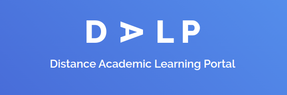

DALP is a swiss army knife for distant real time academic learning

## Features

- Real time WebRTC based teaching solution
- Automatic lecture notes generator
- In built proctoring support
- Equipped with functionality to take quizzes/assesments in class
- Support for supports with low bandwidth, i.e. **low bandwidth mode**
- Automatic transcript generation

## Running the project locally

1. Deploy the azure function
2. Start the backend servers, [refer here](./backend/README.md)
3. Start the front end, [refer here](./website/README.md)
4. Go to [http://localhost:3000](http://localhost:3000) for the kick of awesomeness

## License

MIT License

## Developed by

This platform is proudly made by team `unpaid_interms`

- Allandhir Megharaj (@allandhir)
- Aditya Chandak (@adityachandak287)
- Bhumij Gupta (@bhumijgupta)
- Yash Mehrota (@YashMeh)
